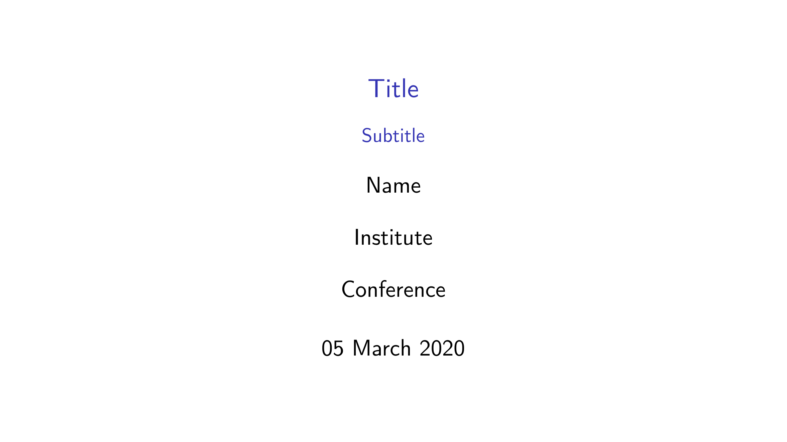
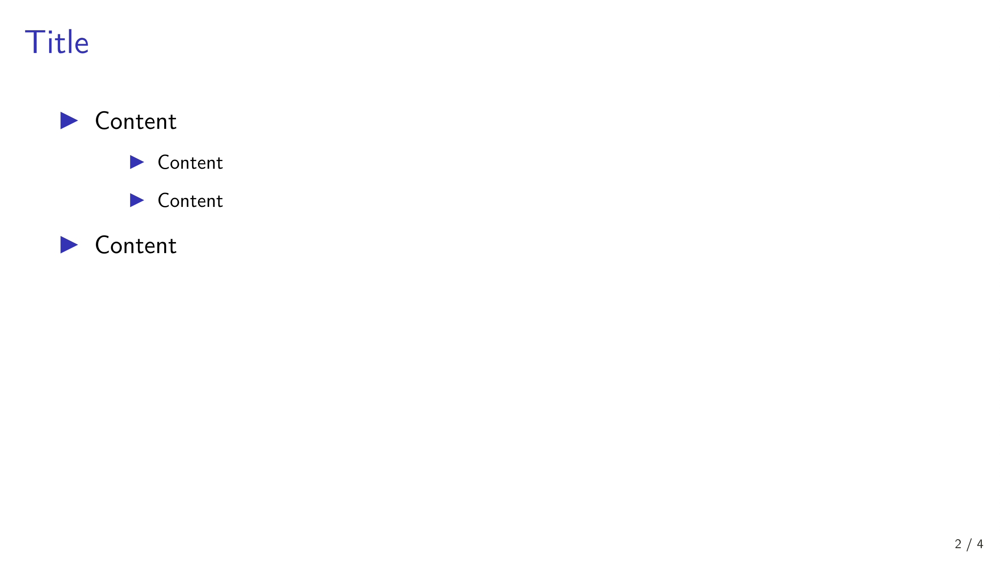
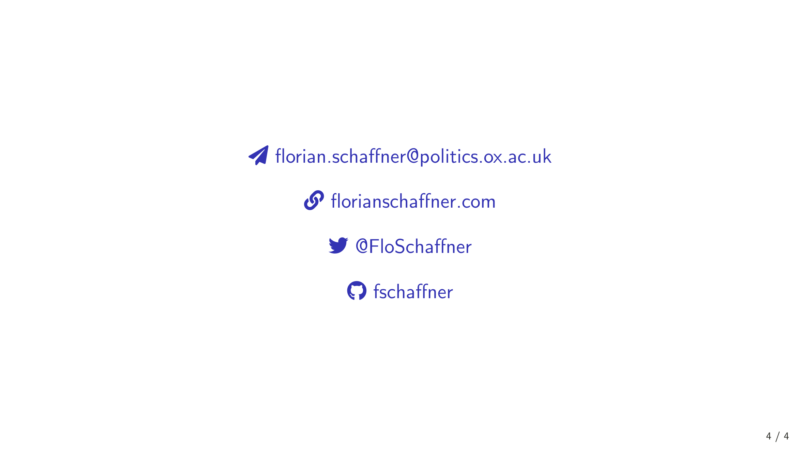

<!-- README.md is generated from README.Rmd. Please edit that file -->

# xaringanbeamer <a href='https://florianschaffner.com/Xplorer'></a>

This package contains a theme for the R package
[xaringan](https://github.com/yihui/xaringan) that emulates the [default
theme](http://deic.uab.es/~iblanes/beamer_gallery/individual/default-default-default.html)
of the beamer class for LaTeX. Simply install the package, select “From
Template” when creating a new Rmarkdown document, and choose the *Beamer
theme for xaringan*. For information on how to change the theme
according to your needs, please refer to the [xaringan
wiki](https://github.com/yihui/xaringan/wiki).

## Example Slides

### Title Slide



### Content Slide



### Social Slide



## Installation

Install the **xaringan** package from CRAN if you haven’t installed it
already:

``` r
if (!require("xaringan")) {
  install.packages("xaringan")
}
```

Install the **xaringanbeamer** package from GitHub:

``` r
remotes::install_github("fschaffner/xaringanbeamer")
```

Please report issues or requests for additional functionality to
<https://github.com/fschaffner/xaringanbeamer/issues>.
